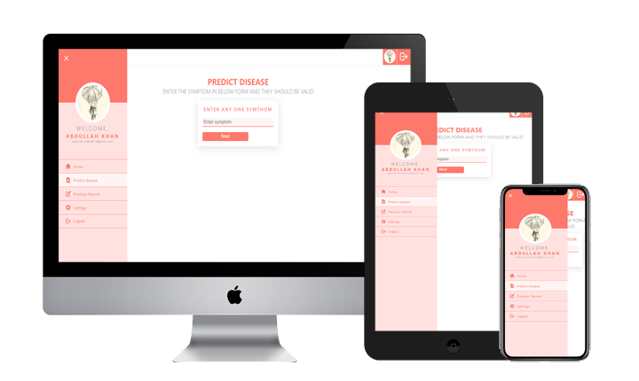

# Smart Health Prediction System

Application of Health prediction system. Developed using React jS, Redux and firebase.



<div align="center">

[](#)
[](#)

</div>

## 🚀 About Project

In this web app patient can login by google account or can sign up here and then login using the registered email, This authentication is achieved by firebase, also each and every validation is integrated. after loging in patient can add a symptom of disease and then system offer them a set of disease and then patient select one on them, on that choice system predict disease and show the disease after showing it shows the option to submit the feedback that are shown on main page of the website. All the record is maintained in firestore and feedbacks are comming live form the tha firestore on the main page plus patient can see there precious record and change his account setting as well. So it is a full stack complete webapp.

## 🪓 Tools

- React JS
- Redux
- firebase

## 👀 Live preview

<a href="https://smart-health-prediction-7dbeb.web.app/">Click here to watch live demo</a>

## 💻 Running steps

- Install Node js if its is not installed already

Open CMD where you want to run the project & run the following commands

First Step:

```
npm i react

```

OR

```
yarn add react

```

Second Step:

```
npm run start

```

OR

```
yarn start

```

## 🎯 Features Updated

✅ Patient Section - Improved

✅ Editing the profile picture and Name each ot together

✅ Real feedback appearing on main page from db

✅ Other fixes from Previous verion.

## 🧑‍🔧 Features Still under progress

- Diseases in DB

- Doctor's section

- Admin's section

## 🧑 Author

#### Abdullah Khan

Email - abdullah.khan53145@gmail.com

Copyright (c) 2020 Abdullah Khan
